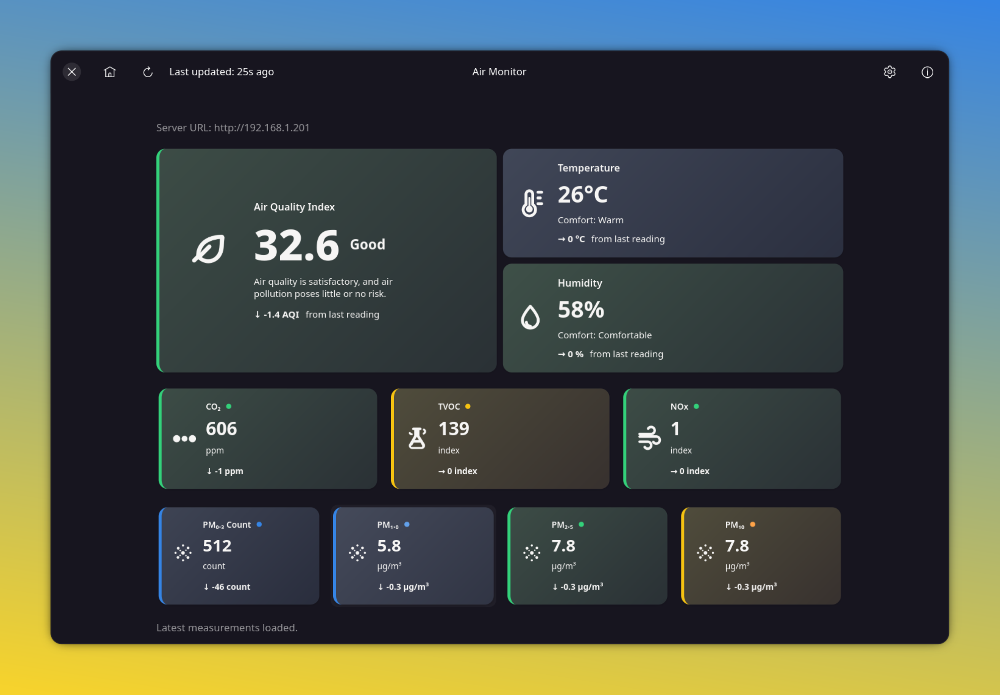
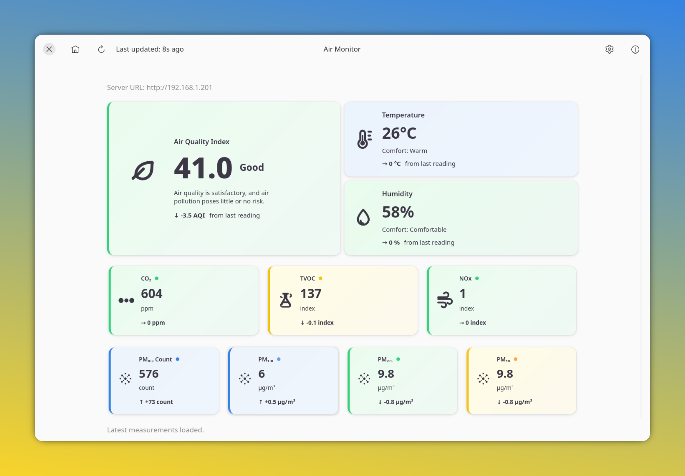
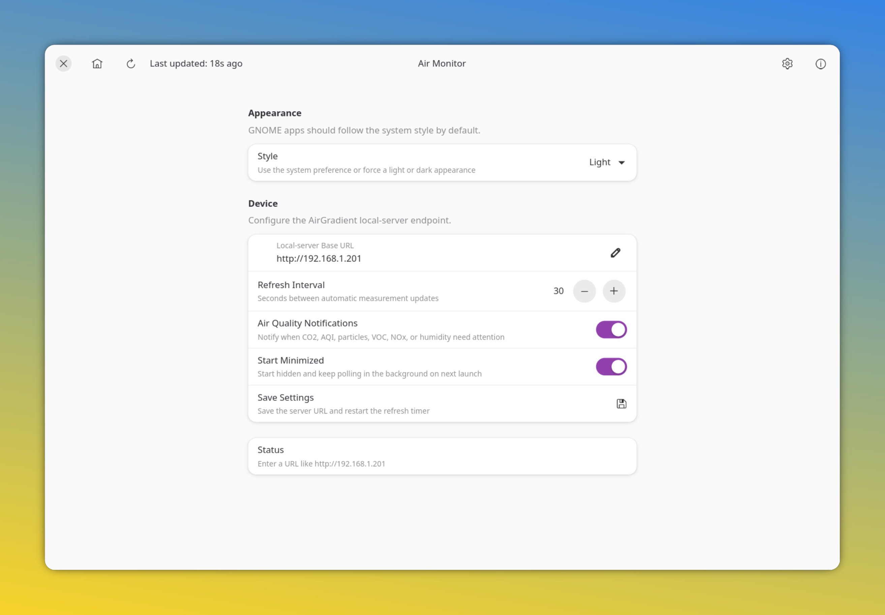

# Air Monitor

Air Monitor is a GTK 4 + libadwaita desktop dashboard for an AirGradient device that exposes the local-server endpoint at `/measures/current`.

The app is intentionally small and direct: configure the device URL, fetch the current measurement payload, normalize it into a Rust data model, and render the result as a GNOME-style air quality dashboard.

## Screenshots







## What It Shows

The dashboard displays:

- Air Quality Index (AQI)
- temperature and humidity
- CO2, TVOC, and NOx
- PM0.3 count, PM1.0, PM2.5, and PM10
- trend indicators based on the previous reading kept in memory
- the last successful update time

Pressure and historical charts are intentionally not part of the current UI.

## How It Works

At a high level:

1. The user configures a local AirGradient device URL in Settings.
2. The app stores the URL in the XDG config directory.
3. The dashboard fetches `{server_url}/measures/current`.
4. The JSON payload is converted into `AirMeasureSnapshot`.
5. GTK widgets are refreshed with values, units, colors, and trend deltas.

For a deeper explanation, see [docs/ARCHITECTURE.md](docs/ARCHITECTURE.md).

## Linux Requirements

Air Monitor targets Linux only.

Runtime dependencies for the raw binary:

- GTK 4 runtime
- libadwaita runtime
- GLib/GIO and GDK Pixbuf runtime libraries
- hicolor icon theme
- CA certificates for HTTP client TLS support
- a desktop notification service
- a StatusNotifier/AppIndicator-compatible tray host if you want the tray icon

Debian/Ubuntu runtime example:

```bash
sudo apt install libgtk-4-1 libadwaita-1-0 libglib2.0-0 libgdk-pixbuf-2.0-0 hicolor-icon-theme ca-certificates libnotify-bin
```

GNOME users may also need the AppIndicator/KStatusNotifier shell extension for tray icons:

```bash
sudo apt install gnome-shell-extension-appindicator
```

Build dependencies:

- Rust toolchain, stable channel
- GTK 4 development files
- Libadwaita 1.4 or newer development files
- `pkg-config`
- `glib-compile-resources`, normally installed with GLib development tools

Debian/Ubuntu build example:

```bash
sudo apt install pkg-config libgtk-4-dev libadwaita-1-dev libglib2.0-dev build-essential
```

Packaging dependencies used by the GitHub Actions release job:

```bash
sudo apt install flatpak flatpak-builder appstream desktop-file-utils patchelf file wget libfuse2t64
```

## Run Locally

```bash
cargo build
cargo run
```

Run tests:

```bash
cargo test
```

Run a release build:

```bash
cargo build --release
```

## Linux Release Artifacts

Tagged releases build and publish Linux-only `amd64` and `arm64` artifacts from GitHub Actions:

- `airgradient-desktop-<version>-linux-<arch>`: the plain executable produced by `cargo build --release`, where `<arch>` is `amd64` or `arm64`. This is the smallest artifact and still requires the runtime dependencies listed above. It does not include desktop launcher files or icons.
- `airgradient-desktop-<version>-linux-<arch>.tar.gz`: raw release binary plus desktop file, metainfo, application icons, and tray icon assets. This still requires the runtime dependencies listed above.
- `airgradient-desktop-<version>-linux-<arch>.flatpak`: Flatpak bundle built against the GNOME runtime. The Flatpak installs the desktop launcher, metainfo, application icon, fallback icon name, and tray icon asset inside the sandbox. It also grants network, notifications, and StatusNotifier watcher access for the AirGradient HTTP endpoint, notifications, and tray registration.
- `airgradient-desktop-<version>-linux-<arch>.AppImage`: self-contained AppImage produced from an AppDir with bundled GTK/libadwaita dependencies where `linuxdeploy` can collect them. It includes the desktop launcher, metainfo, application icons, and tray icon asset. AppImages may still need host graphics, desktop session, D-Bus, and FUSE support.

Install a Flatpak bundle locally:

```bash
flatpak install --user ./airgradient-desktop-0.1.0-linux-amd64.flatpak
flatpak run com.airgradient.desktop
```

Run an AppImage:

```bash
chmod +x airgradient-desktop-0.1.0-linux-amd64.AppImage
./airgradient-desktop-0.1.0-linux-amd64.AppImage
```

## Configure A Device

Open Settings and enter the device base URL. These forms are accepted:

- `http://192.168.1.201/`
- `http://192.168.1.201`
- `192.168.1.201`
- `http://192.168.1.201:80`

The app normalizes the value before saving it. For example, `192.168.1.201` becomes `http://192.168.1.201`.

Configuration is stored at:

```text
$XDG_CONFIG_HOME/airgradient-desktop/config.json
```

If `XDG_CONFIG_HOME` is not set, the fallback is:

```text
$HOME/.config/airgradient-desktop/config.json
```

## Project Layout

```text
src/
  main.rs                 Program entry point.
  app.rs                  Creates the libadwaita application.
  app_info.rs             Shared application ID and display name.
  config.rs               Reads/writes user configuration.
  device.rs               Normalizes device URLs and fetches measurements.
  notifications.rs        Delivers alert notifications through desktop APIs.
  state.rs                In-memory page, URL, theme, and refresh state.
  sensors/
    air_quality.rs        Parses AirGradient JSON into typed values.
    thresholds.rs         Classifies sensor values into semantic statuses.
  ui/
    app.rs                Main window, navigation, and timers.
    dashboard.rs          Dashboard layout and measurement application.
    settings.rs           Settings page and persistence callbacks.
    tray.rs               StatusNotifier tray integration.
    sensor_card.rs        Reusable pollutant metric card.
    aqi_widget.rs         Large AQI widget.
    temperature_widget.rs Temperature widget.
    humidity_widget.rs    Humidity widget.
assets/
  dashboard.css           GTK CSS for the dashboard.
resources/
  airgradient.gresource.xml
  icons/                  Symbolic SVG icons embedded into the binary.
docs/
  ARCHITECTURE.md         How data and UI state move through the app.
  DEVELOPMENT.md          Development workflow and common tasks.
  LOCAL_SERVER.md         AirGradient payload handling notes.
```

## Important Rust Concepts Used Here

This codebase is a useful GTK/Rust learning project because it uses common Rust patterns in a small app:

- `Option<T>` means a sensor value may be missing from the JSON payload.
- `Result<T, String>` is used when a URL, network request, or JSON parse can fail.
- `Rc<RefCell<T>>` is used for shared, mutable state on the GTK main thread.
- `Clone` on GTK widgets is cheap: it clones a reference to the same underlying GObject, not a whole visual tree.
- GTK signals use closures. Values moved into a signal callback usually need to be cloned first.
- Blocking HTTP work is moved off the GTK main loop with `gio::spawn_blocking`.

See [docs/DEVELOPMENT.md](docs/DEVELOPMENT.md) for more detail.

## Theme Support

- The app defaults to the system theme.
- Settings can force System, Light, or Dark mode.
- Dark mode uses a slightly darker app shell background.
- Dashboard text uses explicit GNOME dark palette colors on cards so it remains readable on light gradient cards.

## Dependency Compatibility

`libadwaita` and `gtk4` must be from compatible gtk-rs release trains. This project currently uses:

- `adw` (`libadwaita`) `0.7` with feature `v1_4`
- `gtk4` `0.9`

If you upgrade one, upgrade the related gtk-rs crates together.

The `v1_4` libadwaita feature is enabled because Settings uses native rows such as `AdwEntryRow` and `AdwSpinRow`.

## Install Notes

After building a release binary:

```bash
sudo install -Dm755 target/release/airgradient-desktop /usr/local/bin/airgradient-desktop
sudo install -Dm644 assets/com.airgradient.desktop.desktop /usr/share/applications/com.airgradient.desktop.desktop
sudo install -Dm644 assets/com.airgradient.desktop.metainfo.xml /usr/share/metainfo/com.airgradient.desktop.metainfo.xml
sudo install -Dm644 assets/airgradient-desktop.svg /usr/share/icons/hicolor/scalable/apps/com.airgradient.desktop.svg
sudo install -Dm644 assets/airgradient-desktop.svg /usr/share/icons/hicolor/scalable/apps/airgradient-desktop.svg
sudo install -Dm644 assets/airgradient-desktop.png /usr/share/icons/hicolor/256x256/apps/com.airgradient.desktop.png
sudo install -Dm644 assets/airgradient-tray.png /usr/share/icons/hicolor/256x256/status/airgradient-tray.png
sudo install -Dm644 assets/airgradient-tray.png /usr/share/icons/hicolor/256x256/status/airgradient-desktop.png
sudo install -Dm644 assets/airgradient-tray.png /usr/share/icons/hicolor/256x256/status/com.airgradient.desktop.png
sudo update-desktop-database /usr/share/applications
```

## References

- [AirGradient local-server documentation](https://github.com/airgradienthq/arduino/blob/master/docs/local-server.md)
- [gtk-rs documentation](https://gtk-rs.org/)
- [gtk4-rs book](https://gtk-rs.org/gtk4-rs/git/book/)
- [GNOME Human Interface Guidelines](https://developer.gnome.org/hig/)
